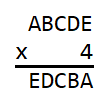
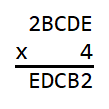
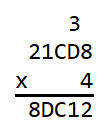
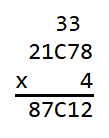
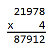

# Five Digit Number Times 4 Answer

**21978**

It is first helpful to make a list of the products of each digit multiplied by 
4.

|factors|product|
|:-----:|:-----:|
| 0 x 4 |   0   |
| 1 x 4 |   4   |
| 2 x 4 |   8   |
| 3 x 4 |  12   |
| 4 x 4 |  16   |
| 5 x 4 |  20   |
| 6 x 4 |  24   |
| 7 x 4 |  28   |
| 8 x 4 |  32   |
| 9 x 4 |  36   |

Starting at the beginning, we see that 

 

In order for the product EDCBA to be five digits, A must be either 1 or 2 so 
that in the ten thousands column A x 4 is not greater than 9. In the ones 
column, the last digit of E x 4 must end with A (1 or 2). Looking at the table 
above we see that no product ends with a 1, so A must be 2. We now have 

 

Because A is 2, E must now be either 3 or 8 so that in the ones column E x 4 
ends with a 2. In the ten thousands column, E cannot be less than 8 because 2 x 
4 is 8. This means that E must be 8. Carrying a 3 into the tens column we have 

 

Because E is 8 and not 9 in the ten thousands column, B x 4 in the thousands 
column must result in a single digit number so that nothing is carried over 
into the ten thousands column. This means that B must be 0, 1, or 2. The other 
condition is that in the tens column D x 4 + 3 must end with B. From the table 
above we see that D x 4 always ends in an even number, so D x 4 + 3 will always 
end in an odd number. This means that B must be odd and therefore must be 1. We 
now have 

 

Because B is 1 so that in the tens column D x 4 + 3 must end in a 1, D x 4 must 
end in an 8. This means that D must be either 2 or 7. However, D cannot be less 
than 4 because in the thousands column 1 x 4 is 4. This means that D must be 7. 
Carrying a 3 into the hundreds column from 7 x 4 + 3 we have 

 

In the thousands column we see that a 3 needs to be carried over from the 
hundreds column so that 1 x 4 + 3 is 7. This means that in the hundreds column 
C x 4 + 3 must begin with a 3 and also must end with a C. In order for C x 4 + 
3 to begin with a 3, C must be either 7, 8, or 9. From the table above we can 
see that C x 4 always ends with an even number so C x 4 +3 always ends with an 
odd number. This means that C must be odd and is now either 7 or 9. If C were 
7, 7 x 4 + 3 is 31 in which the last digit is not 7. This means that C is not 7 
and must be 9. We can see that 9 x 4 + 3 is 39 in which the last digit is 9. In 
the end we see that the answer is 21978 and we have 

 
